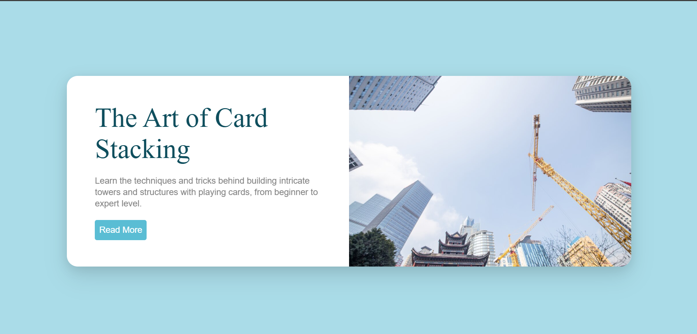
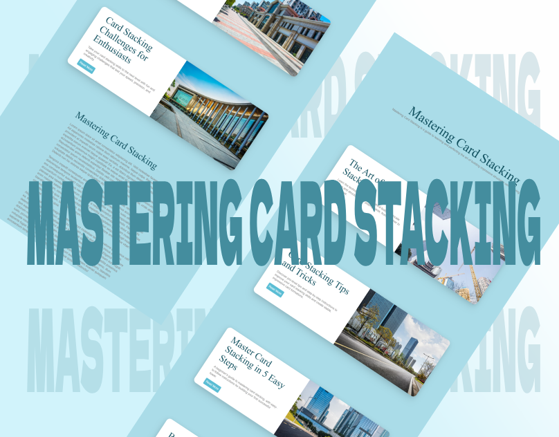

# Mastering Card Stacking | Learn the Art of Card Stacking

### Author
##### Virendra D. Verma

<a href="https://www.linkedin.com/in/dharmendraverma95/" target="_blank">LinkedIn Profile </a>

<a href="https://www.behance.net/dhirukumar" target="_blank">Behance Profile </a>

# Overview

# Mastering Card Stacking | Learn the Art of Card Stacking

Card stacking is the art of arranging playing cards to form towers or structures. While it may sound simple, card stacking requires patience, precision, and a steady hand. This guide will take you through the process, from building your first tower to mastering complex structures.

## Features
- **CSS-Only Solution**: Achieve horizontal scrolling with just CSS, no JavaScript required.
- **Sticky Elements**: Use `position: sticky` to create fixed scrolling elements that stay in place while the content scrolls horizontally.
- **Responsive Design**: Easily adaptable for different screen sizes and devices.

# Preview
Mastering Card Stacking | Learn the Art of Card Stacking
 

 
Mastering Card Stacking | Learn the Art of Card Stacking Start & End Point 
 
<a href="https://www.behance.net/gallery/217409495/Mastering-Card-Stacking" target="_blank">

 

</a>
 
Mastering Card Stacking UI UX Layout
 

 
Mastering Card Stacking UI UX Layout
 

 
Cover
 

 

### Technologies Used
<ul>
  <li>Graphic Design Software: Adobe Illustrator, Photoshop, Figma (for mockups)</li>
  <li>Web Tools (Optional): HTML5, CSS3 for any digital presentations or landing pages</li>
  <li>Font Awesome (Optional for icons)</li>
</ul>

###  Acknowledgments
Inspired by the power of CSS positioning and scrolling techniques.

